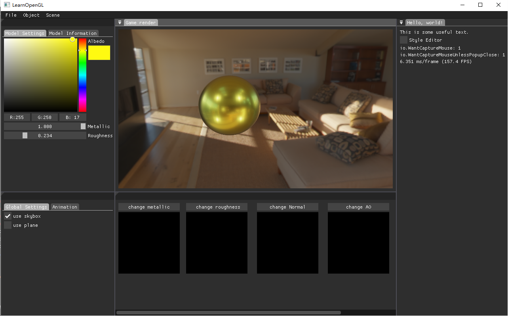

# Almost Renderer

# 





Features：

- OpenGL3.3 based

- Instanced rendering

- deferred rendering

- .obj model file

- Skeleton animation

- PBR Material

- Disney principled BRDF

- IBL

- Importance Sampling

- Physically Based Bloom

- RealTime RayTracing

  # 

2023.12.5

------

终于完成了实时光线追踪部分啦，此篇ReadMe会重要讲解几个程序的部分，数学原理及其他可能会在知乎平台更新罢。

## 如何将画面渲染在特定窗口


直接上结论：1.项目中加载一个轻量级开源UI项目imGUI。

​					   2.除了所有渲染本身需要的帧缓冲外，额外创建一个帧缓冲，帧缓冲绑定颜色纹理作为渲染在特定窗口的图片，我们让他叫做imGUIFBO。

​					   3.在imGUIFBO中渲染场景，用imGUI创建一个窗口，窗口里创建image组件，绑定imGUIFBO的纹理给image，即可完成。


我们在github中找到imGUi项目，选择分支中docking的这个


我们先在项目中新建一个文件夹，$\textcolor{Red}{确保显示的是文件夹不是筛选器！} $(可以点开项目，点击显示所有文件切换到文件夹)用来储存我们需要的imgui文件。接下来在在我们下载好的i$\textcolor{颜色名}{文字内容} $mgui文件的主目录中将所有.h结尾和.cpp结尾的文件拖到我们的文件夹中


再进入backends文件


选择这几个文件一样拖入imgui文件夹。然后我们要让imgui文件夹真正导入我们的项目中。在解决方案资源管理器里选中项目，点击属性，点击C/C++，点击附加包含目录最后的箭头打开编辑输入第一行命令后点击确定即可。

除此之外，有些必要代码需要放在你的main项目中，一个是在你放的createWindow之后。

```C++
ImGui::CreateContext();
ImGui::StyleColorsDark();
ImGui_ImplGlfw_InitForOpenGL(window, true);
ImGui_ImplOpenGL3_Init(glsl_version);//自己的openGLversion，比方说3.3可以输入"#version 330 core"
```

还有在循环渲染的while中

```C++
while(!glfwWindowShouldClose(window)){
...//你的场景渲染

ImGui_ImplOpenGL3_NewFrame();
ImGui_ImplGlfw_NewFrame();
ImGui::NewFrame();//创建imGUI的窗口渲染

...//渲染imGUI组件

ImGui_ImplOpenGL3_Shutdown();
ImGui_ImplGlfw_Shutdown();
ImGui::DestroyContext();//关闭imGUI窗口渲染
}
```

具体的可以看看imgui的main.cpp，我们可以运行一下他给的案例，也就是main.cpp


可以看到有这样一个窗口，他的代码如下

```C++
ImGui::Begin("Hello, world!");                          // Create a window called "Hello, world!" and append into it.

ImGui::Text("This is some useful text.");               // Display some text (you can use a format strings too)
ImGui::Checkbox("Demo Window", &show_demo_window);      // Edit bools storing our window open/close state
ImGui::Checkbox("Another Window", &show_another_window);

ImGui::ColorEdit3("clear color", (float*)&clear_color); // Edit 3 floats representing a color

if (ImGui::Button("Button"))                            // Buttons return true when clicked (most widgets return true when edited/activated)
counter++;
ImGui::SameLine();
ImGui::Text("counter = %d", counter);
            
ImGui::Text("Application average %.3f ms/frame (%.1f FPS)", 1000.0f / ImGui::GetIO().Framerate, ImGui::GetIO().Framerate);
ImGui::End();
```

我们可以看到决定imGUI范围的是imGUI::Begin();直到imGUI::End();来决定生成了一个组件，里面包含着种种交互功能，可以以后自己根据需求自定义。而我们要做的就是在begin和end之间加入一个Image，这是imGUI显示图片的功能。

接下来我们进行第二步和第三步，将场景渲染在imGUIFBO，但记得创建一个FBO

```C++
...//创建窗口，写shader，创建其他fbo之类的阿巴阿巴。
    
 unsigned int imGUIFBO;
    glGenFramebuffers(1, &imGUIFBO);
    glBindFramebuffer(GL_FRAMEBUFFER, imGUIFBO);
    
    
    glGenTextures(1, &imGUItexture);
    glBindTexture(GL_TEXTURE_2D, imGUItexture);
    glTexImage2D(GL_TEXTURE_2D, 0, GL_RGB, screenWidth, screenHeight, 0, GL_RGB, GL_UNSIGNED_BYTE, NULL);
    glTexParameteri(GL_TEXTURE_2D, GL_TEXTURE_MIN_FILTER, GL_LINEAR);
    glTexParameteri(GL_TEXTURE_2D, GL_TEXTURE_MAG_FILTER, GL_LINEAR);
    glFramebufferTexture2D(GL_FRAMEBUFFER, GL_COLOR_ATTACHMENT0, GL_TEXTURE_2D, imGUItexture, 0);
    
    unsigned int rbo;
    glGenRenderbuffers(1, &rbo);
    glBindRenderbuffer(GL_RENDERBUFFER, rbo);
    glRenderbufferStorage(GL_RENDERBUFFER, GL_DEPTH24_STENCIL8, screenWidth, screenHeight);
    glFramebufferRenderbuffer(GL_FRAMEBUFFER, GL_DEPTH_STENCIL_ATTACHMENT, GL_RENDERBUFFER, rbo); 
    
    if (glCheckFramebufferStatus(GL_FRAMEBUFFER) != GL_FRAMEBUFFER_COMPLETE)
        cout << "ERROR::FRAMEBUFFER:: Framebuffer is not complete!" << endl;
    glBindFramebuffer(GL_FRAMEBUFFER, 0);

...//其他需要的东西，或有或无。
while(!glfwWindowShouldClose(window)){
    glBindFramebuffer(GL_FRAMEBUFFER, imGUIFBO);
    glClearColor(0.1f, 0.1f, 0.1f, 1.0f);
    glClear(GL_COLOR_BUFFER_BIT | GL_DEPTH_BUFFER_BIT);
    glEnable(GL_DEPTH_TEST);
    
    shader.use();
    ...//figure你的shader
    glDraw();//渲染画面
    
    //第三步
    --------------------------------------------
    ImGui::Begin("Game render");
    ImGui::BeginChild("GameRender");
    ImVec2 wsize = ImGui::GetWindowSize();
    ImGui::Image((ImTextureID)imGUItexture, wsize, ImVec2(0, 1), ImVec2(1, 0));//这里传入Image纹理是倒过来的，所以我们在最后输入参数的的时候不能传入ImVec2(0,0)和ImVec2(1,1),而是要这么输入参数
    
    
    //if (ImGui::IsItemHovered())
      	//ImGui::CaptureMouseFromApp(false);实现鼠标拖动渲染画面的，在这可以忽略

    ImGui::EndChild();
     ImGui::End();
}
```

那么现在渲染画面就可以渲染在特定窗口啦，之后我们可以开启Docking模式，实现在画面中固定imGUI的窗口，让画面更加。。专业（？）

具体打开方式：

```C++
ImGui::CreateContext();//找到先前imGUI初始化的这行代码的位置
//后面加上这几行
ImGuiIO& io = ImGui::GetIO(); (void)io;
ImGui::GetIO().ConfigFlags |= ImGuiConfigFlags_DockingEnable;
```

现在自定义自己的GUI画面吧！
